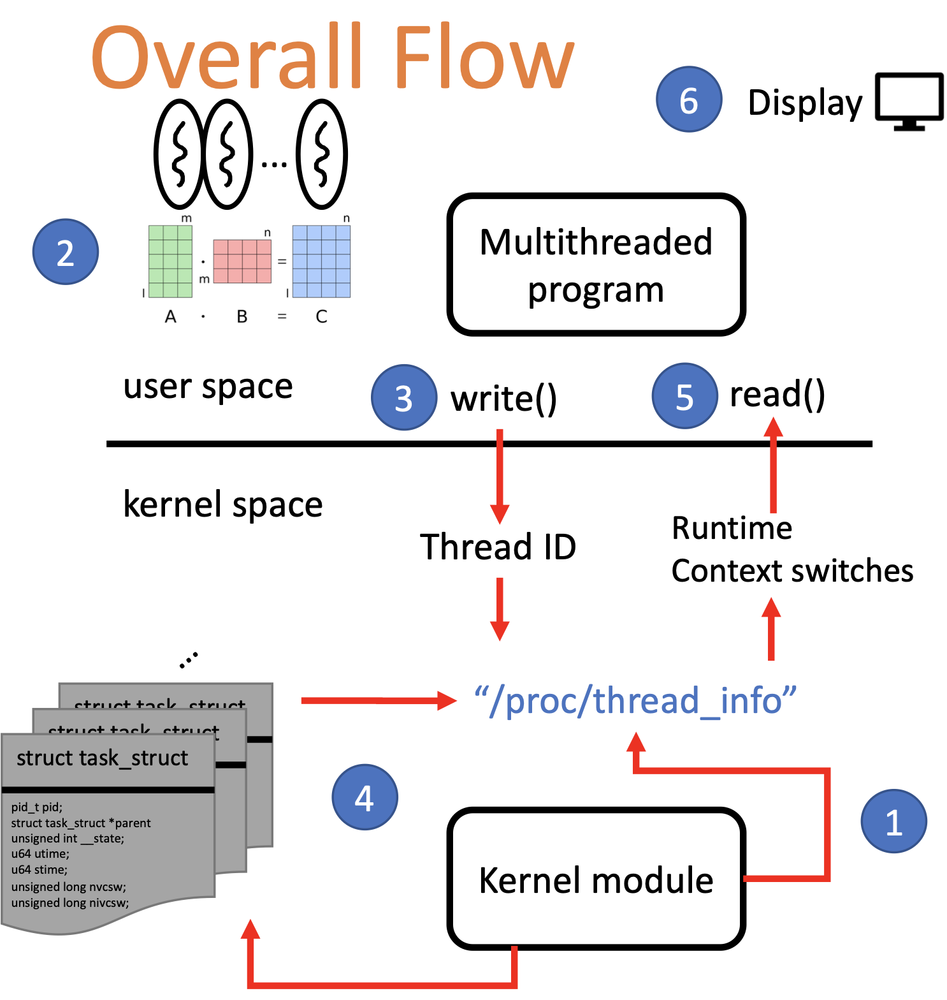

# Multi-threaded-and-kernel-module-programming
## Objectives
### Multi-threaded Program
#### Take advantage of multi-core systems
#### Load sharing
### Linux Kernel Module
#### Understand how to write a kernel module
#### Understand how to provide read/write operations of proc files to users
## Overall Flow
1. The kernel module creates a proc entry/file
2. The multithreaded program does the matrix multiplication
3. Each thread writes its thread ID to the proc entry
4. The kernel module gets and records the runtime and context switch times of the thread
5. The multithreaded program reads the proc entry to get the runtime and context switch information
6. The multithreaded program displays the information on the console

